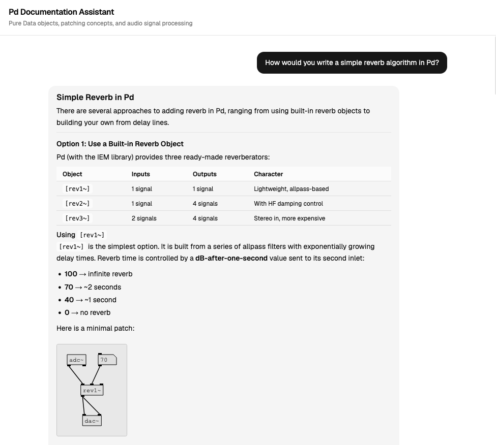

# Pd Documentation Assistant

A retrieval-augmented generation (RAG) chatbot for answering questions about [Pure Data](http://msp.ucsd.edu/Pd_documentation/) (Pd) — a visual programming language for audio and multimedia. The assistant draws on the official Pd documentation and a synthesis textbook to answer questions about objects, patching concepts, audio signal processing, and synthesis techniques.



## Sources

The corpus is built from three sources:

| Source | Content |
|---|---|
| [Pure Data Manual](http://msp.ucsd.edu/Pd_documentation/) (Miller Puckette / UCSD) | Conceptual documentation: patching, messages, signal processing, DSP theory |
| [IEM Object Reference](https://pd.iem.sh/objects/) | Per-object documentation: inlets, outlets, arguments, and descriptions for all vanilla Pd objects |
| [The Theory and Techniques of Electronic Music](http://msp.ucsd.edu/techniques.htm) (Miller Puckette) | Synthesis technique implementation in Pd: FM, waveshaping, filters, delay networks, granular synthesis, and more |

## How It Works

### Pipeline

```
HTML source files
      ↓
parse_manual.py / parse_object_reference.py / parse_book.py
      ↓
parsed_*.json  (structured sections with metadata)
      ↓
chunk.py  (parent-child chunking, 600-char child chunks with 100-char overlap)
      ↓
child_chunks.json + parent_chunks.json
      ↓
embed_and_index.py  (Voyage AI embeddings → ChromaDB)
      ↓
chroma_db/  +  parent_lookup.json
```

### Retrieval

At query time, `rag.py` runs a hybrid search:

1. **Query classification** — Claude Haiku classifies the query type (`object_reference`, `conceptual`, or `both`), extracts any Pd object names mentioned, and rewrites the query as a standalone search string when conversation history provides context
2. **Vector search** — Voyage AI embeds the (rewritten) query; ChromaDB finds semantically similar child chunks
3. **BM25 keyword search** — exact token matching against the original query, weighted toward object names
4. **Reciprocal Rank Fusion (RRF)** — combines vector and BM25 rankings into a single ranked list
5. **Parent retrieval** — the top child chunks are mapped back to their full parent sections for richer context

Retrieval quality is measured and regressed in CI — see **[Evaluation Results](EVAL.md)** for current hybrid RRF vs. vector-only vs. BM25-only metrics.

### Response Generation

Retrieved chunks are passed as context to Claude Sonnet, which streams a response grounded in the documentation via Server-Sent Events (SSE). The frontend begins rendering tokens as they arrive, so answers start appearing within ~1 second of retrieval completing. Responses may include:

- Inline `[object~]` references in code spans
- Markdown tables for structured object comparisons
- **Pd patch diagrams** — when a concrete signal chain is described, the model emits a `pd-patch` JSON block that the frontend renders as an SVG diagram matching the Pd editor's visual style. Patch JSON is validated server-side with Pydantic and retried on failure (see [Quality](#quality)).

The SVG renderer supports all standard Pd box types: `obj` (rectangle), `msg` (notched right edge), `floatatom` (corner-cut number box), `comment` (text label), `table`/`array` (named data stores), and UI widgets (`bng`, `tgl`, `hsl`, `vsl`, etc.). Inlet and outlet nubs and patch cords are drawn automatically; layout is computed with [dagre](https://github.com/dagrejs/dagre).

### Caching

Responses are cached in-process (`cachetools.TTLCache`, 1-hour TTL, keyed by normalised question) so repeated queries return immediately without re-running retrieval or generation. Cache hits are flushed as a single SSE burst.

## Evaluation

A 30-entry golden dataset and automated evaluation harness measure retrieval
quality and guard against regressions.

| Strategy | recall@5 | MRR |
|----------|----------|-----|
| Hybrid RRF | 80% | 0.76 |
| Vector-only | 73% | 0.61 |
| BM25-only | 37% | 0.26 |

Current numbers are published in **[EVAL.md](EVAL.md)**, updated on every push to
`main` by a GitHub Actions workflow.

**Retrieval metrics**: recall@k, MRR, nDCG — with ablation against
vector-only and BM25-only baselines to prove hybrid RRF wins.

**Generation metrics**: faithfulness, answer relevance, and citation
correctness scored by a Claude-as-judge rubric (LLM-as-judge).

**CI gating**: `pytest tests/` asserts thresholds (recall@5 ≥ 60%, MRR ≥
0.30, hybrid ≥ both baselines). Runs on every PR and push.

## Quality

### pd-patch validation

Patch diagram JSON is validated server-side with Pydantic (`pd_schema.py`).
If a block fails validation in the synchronous `chat()` path, the answer is
retried once with a correction prompt. The streaming path replaces malformed
blocks with a `[patch diagram]` placeholder. Parse failures are tracked via
New Relic (`Custom/PdPatch/ParseFailure`) and Langfuse (`pd_patch_valid`
score).

### Feedback loop

Every assistant response carries a `message_id` (SHA-256 of the question).
Thumbs up/down buttons in the chat UI submit cryptographically-signed
feedback (`POST /feedback`) to a SQLite store, capturing the question,
answer, retrieved chunks, and rating. The data grows an eval set from real
usage.

### API auth

The backend accepts multiple API keys (`CHAT_API_KEYS`, comma-separated in
env), enabling zero-downtime rotation. The `/feedback` endpoint additionally
requires an HMAC-SHA256 signature over the payload, preventing replay attacks
(60-second window).

## Stack

**Backend**
- [FastAPI](https://fastapi.tiangolo.com/) + uvicorn
- [ChromaDB](https://www.trychroma.com/) — vector store (embedded, file-backed)
- [Voyage AI](https://www.voyageai.com/) — embeddings (`voyage-3-lite`)
- [Anthropic Claude](https://www.anthropic.com/) — classification (`claude-haiku-4-5`) + generation (`claude-sonnet-4-6`)
- [rank-bm25](https://github.com/dorianbrown/rank_bm25) — keyword search
- slowapi — rate limiting (10/min `/chat`, 30/min `/feedback`)
- New Relic APM — request tracing, external call instrumentation (Anthropic, Voyage AI), cache hit/miss metrics, pd-patch validation failure tracking
- [Langfuse](https://langfuse.com) (self-hosted on Railway) — LLM-native tracing: token accounting (input/output/cache-read), trace trees (classify → embed → retrieve → generate), cost attribution
- SQLite (`feedback.db`) — feedback store, no additional dependencies

**Frontend**
- React 19 + TypeScript + Vite
- Tailwind CSS v4 + shadcn/ui
- [dagre](https://github.com/dagrejs/dagre) — directed graph layout for patch diagrams
- SVG patch renderer — renders Pd-style object boxes, inlet/outlet nubs, and patchcords
- New Relic Browser — page performance, AJAX tracking, JS error monitoring

## Deployment

The application is deployed as two separate services:

| Layer | Platform | Config |
|---|---|---|
| Backend (FastAPI) | [Railway](https://railway.app) | `railway.json` |
| Frontend (React/Vite static build) | [Vercel](https://vercel.com) | `frontend/vercel.json` |

The Vercel deployment rewrites `/api/*` to the Railway backend URL server-side, so the browser never makes cross-origin requests and CORS is not required for production.

Railway runs `embed_and_index.py` as part of the build step to construct ChromaDB from the committed chunk files (`child_chunks.json`, `parent_chunks.json`). ChromaDB itself is not committed — it is rebuilt on each deploy.

### CI/CD

A [GitHub Actions workflow](.github/workflows/eval.yml) runs on every push and
PR:

1. Builds ChromaDB from committed chunk files
2. Runs the retrieval evaluation (recall@k, MRR, nDCG) and writes `EVAL.md`
3. Auto-commits `EVAL.md` to `main` (skips on PRs)
4. Runs `pytest tests/` with threshold assertions

Requires `ANTHROPIC_API_KEY` and `VOYAGE_API_KEY` set as [repository secrets](https://github.com/wilsontr/pd-chatbot/settings/secrets/actions).

## Setup

### Prerequisites

- Python 3.11+
- Node.js 18+
- Voyage AI API key
- Anthropic API key

### Backend

```bash
python -m venv venv
source venv/bin/activate
pip install -r requirements.txt
```

Create a `.env` file:

```
VOYAGE_API_KEY=...
ANTHROPIC_API_KEY=...
CHAT_API_KEYS=...            # comma-separated for rotation; e.g. "key1,key2"
ALLOWED_ORIGIN=http://localhost:5173
# Optional — Langfuse LLM observability
LANGFUSE_SECRET_KEY=sk-lf-...
LANGFUSE_PUBLIC_KEY=pk-lf-...
LANGFUSE_BASE_URL=http://localhost:3000
```

### Build the corpus

`child_chunks.json`, `parent_chunks.json`, and `parent_lookup.json` are committed to the repo and are sufficient to run `embed_and_index.py` directly. Re-parsing from source is only needed if you modify the source documents or parsing logic.

```bash
# Re-parse source documents (optional — only if modifying parse logic)
python parse_manual.py
python parse_object_reference.py
python parse_book.py          # requires puckette_book/ local mirror

# Chunk (optional — only if re-parsing above)
python chunk.py

# Index — always required on first run or after re-chunking
python embed_and_index.py     # makes ~20 Voyage AI API calls, writes chroma_db/
```

The `puckette_book/` directory should contain a local mirror of the HTML edition of *The Theory and Techniques of Electronic Music*, available at `http://msp.ucsd.edu/techniques.htm`. It is gitignored and only needed if re-running `parse_book.py`.

### Run

```bash
# Backend
uvicorn main:app --reload

# Frontend
cd frontend && npm install && npm run dev
```

The frontend proxies `/api` to `http://localhost:8000` (configured in `vite.config.ts`).

### Observability (optional)

There are two layers:

**New Relic APM** — request tracing, external call instrumentation, custom
metrics. Inactive without credentials. To enable:

**Backend (Railway env vars):**
```
NEW_RELIC_LICENSE_KEY=...
NEW_RELIC_APP_NAME=pd-chatbot-backend
NEW_RELIC_LOG=stdout
NEW_RELIC_LOG_LEVEL=info
```

**Frontend (Vercel env vars):**
```
VITE_NR_LICENSE_KEY=...       # browser license key (from NR snippet)
VITE_NR_APP_ID=...
VITE_NR_ACCOUNT_ID=...
```

The Railway start command (`railway.json`) uses `newrelic-admin run-program` to bootstrap the Python APM agent. The frontend initialises `BrowserAgent` in `src/main.jsx`, guarded by `VITE_NR_LICENSE_KEY` so local dev without credentials is unaffected.

**Langfuse** (LLM-native tracing) — token counts, trace trees, cost attribution.
Self-hosted on Railway via the [Langfuse v3 template](https://langfuse.com/self-hosting/deployment/railway).
Set these env vars on the backend:

```
LANGFUSE_SECRET_KEY=sk-lf-...
LANGFUSE_PUBLIC_KEY=pk-lf-...
LANGFUSE_BASE_URL=https://langfuse-web-production-xxxx.up.railway.app
```

When unset, the system degrades gracefully — all observations become no-ops.
